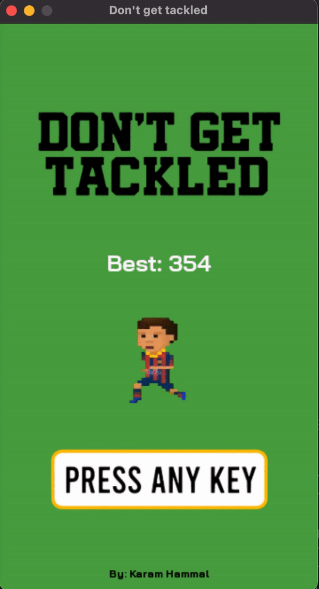

# Don't Get Tackled

You're Lionel Messi, and you're going up against your most fiersome rivals, Real Madrid! Dribble past the defenders and avoid their tackles at all costs!

This game was made with Python and Pygame.
Inspired by [Don't Touch My Presents](https://github.com/Gooodgis/dont-touch-my-presents), the design and concept were changed into a soccer game and certain functionality was added/changed to support the new design and concept.

## Demo



## How to Play

* Use the arrow keys to maneuver your player out of the way.

## Installation

### Windows

Open Command Prompt and run the following:

```sh
pip install pygame
```

### Mac

Open Terminal and run the following:

```sh
pip3 install pygame
```

### Linux

Debian / Ubuntu

```sh
sudo apt-get install python3-pygame
```

Arch

```sh
sudo pacman -S python-pygame
```

Fedora

```sh
sudo dnf install python3-pygame
```

